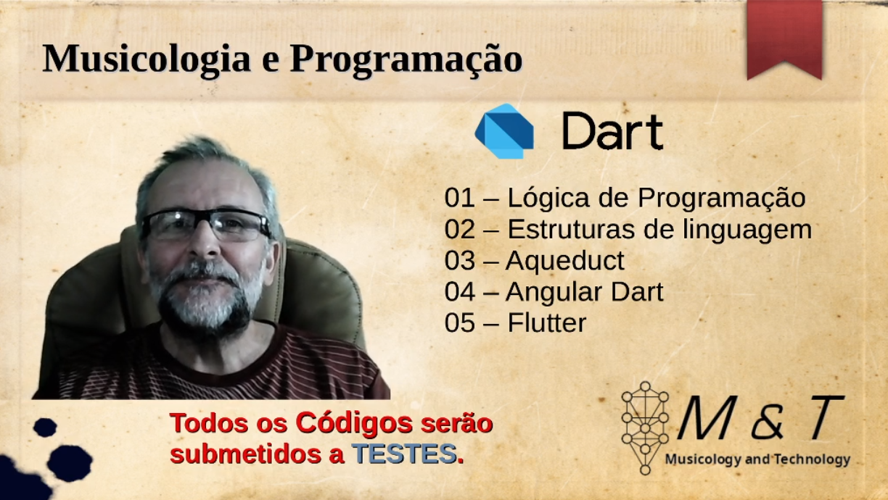

# Dart e Algumas Possibilidades
Este tópico está diretamente relacionado a [playlist](https://www.youtube.com/playlist?list=PLQvwSWYdLssx9hK-xn5gBVx8oOVu6tG7U) que criei em meu canal no youtube onde abordo algumas possibilidades da linguagem com exemplos práticos de códigos voltados a musicologia.

